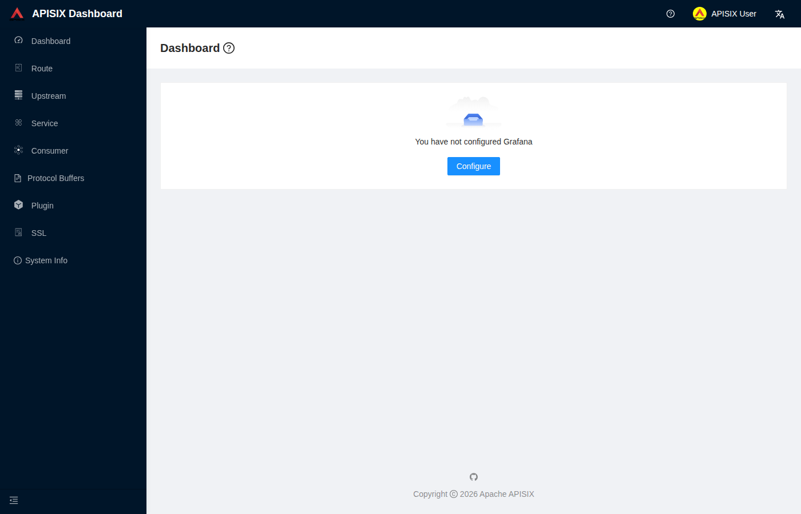
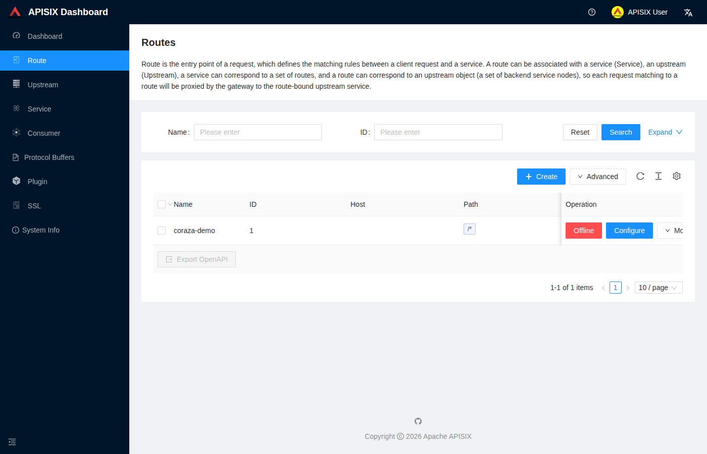
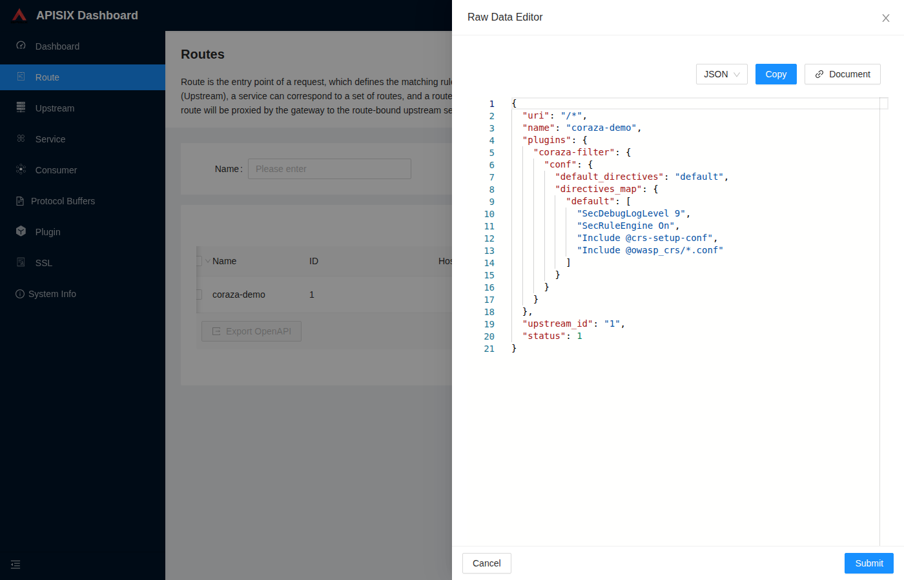
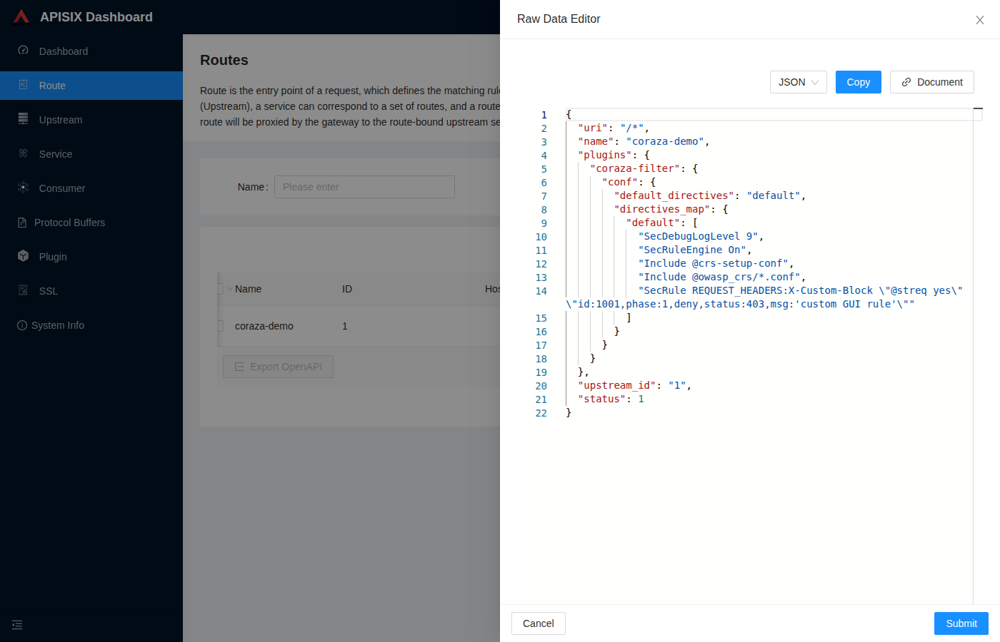

# Coraza-APIsix

Docker Compose setup that puts the [Coraza](https://coraza.io/) WAF, running
the OWASP Core Rule Set (CRS), in front of Apache APISIX. Coraza runs as a
[coraza-proxy-wasm](https://github.com/corazawaf/coraza-proxy-wasm) filter
loaded by APISIX's Wasm plugin runtime.

## Stack

| Service  | Image                              | Role                                |
|----------|-------------------------------------|--------------------------------------|
| etcd      | `quay.io/coreos/etcd`               | APISIX configuration store           |
| apisix    | built from `apisix/Dockerfile`      | API gateway + Coraza WAF (CRS)       |
| httpbin   | `mccutchen/go-httpbin`              | Demo upstream service                |
| dashboard | `apache/apisix-dashboard`           | Web UI for routes and plugin config  |

## Prerequisites

- Docker and Docker Compose

## Quick start

```bash
docker compose up -d --build
./scripts/push-route.sh
```

`push-route.sh` registers the demo upstream and a route protected by the
Coraza WAF plugin with the full CRS rule set enabled.

Verify it's working:

```bash
# clean request -> 200
curl -s -o /dev/null -w '%{http_code}\n' -H 'Host: apisix.test' \
  http://127.0.0.1:9080/anything

# SQL injection pattern -> 403 (blocked by CRS)
curl -s -o /dev/null -w '%{http_code}\n' -H 'Host: apisix.test' \
  -G http://127.0.0.1:9080/anything --data-urlencode "id=1' OR '1'='1"
```

A `Host` header other than the raw IP is used because CRS flags numeric-IP
hosts by default.

## Ports

| Port | Purpose            |
|------|---------------------|
| 9080 | APISIX data plane   |
| 9180 | APISIX Admin API    |
| 8080 | httpbin (direct)    |
| 2379 | etcd client API     |
| 9000 | Dashboard UI        |

## Dashboard

A web UI is available at `http://localhost:9000` (login `admin` / `admin`).
It reads and writes the same etcd store as the Admin API, so routes,
upstreams, and the `coraza-filter` plugin's CRS directives can be viewed or
edited there directly, and changes take effect the same way as the CLI
scripts below — no reload needed.

Change the default credentials and secret in `dashboard/conf.yaml` before
using this outside a local test environment.

`dashboard/schema.json` is the dashboard's bundled plugin schema with a
`coraza-filter` entry added — the stock image doesn't recognize this
custom wasm plugin, so without it the dashboard refuses to save any route
that references it (`schema not found` error), in both the visual plugin
editor and the raw JSON editor.

### Adding a custom rule via the GUI

1. Log in at `http://localhost:9000` (`admin` / `admin`).

   

2. Open **Route**, where `coraza-demo` (the route from `push-route.sh`)
   is listed.

   

3. Use the row's **More → View** action, not **Configure** — the
   step-by-step wizard's plugin picker fails to render plugin cards in
   this dashboard build (a Monaco editor web-worker issue), so it's not
   usable for editing `coraza-filter`. **View** opens a raw JSON editor
   for the whole route instead.

   

4. Add a rule to the `directives_map.default` array, e.g.:

   ```
   SecRule REQUEST_HEADERS:X-Custom-Block "@streq yes" "id:1001,phase:1,deny,status:403,msg:'custom GUI rule'"
   ```

   

5. Click **Submit**. This writes straight to etcd, same as the Admin API
   scripts — no reload, and no dropped requests for traffic already in
   flight.

Verify it immediately:

```bash
curl -s -o /dev/null -w '%{http_code}\n' -H 'Host: apisix.test' \
  http://127.0.0.1:9080/anything                                  # 200

curl -s -o /dev/null -w '%{http_code}\n' -H 'Host: apisix.test' \
  -H 'X-Custom-Block: yes' http://127.0.0.1:9080/anything          # 403
```

## Testing config reload under load

APISIX propagates plugin configuration changes (e.g. route rules, WAF
settings) to every worker via its etcd watch, with no reload command and
no worker restart. `scripts/toggle-etcd-rule.sh` and `scripts/load-test.sh`
demonstrate this:

```bash
# terminal 1
./scripts/load-test.sh

# terminal 2
./scripts/toggle-etcd-rule.sh Off
./scripts/toggle-etcd-rule.sh On
```

Stop the load generator with Ctrl+C to see the request/error count, or
inspect the full log at `/tmp/coraza-load-test.log`.

## Repository layout

```
apisix/                 APISIX image (Dockerfile, config.yaml)
dashboard/               Dashboard config (conf.yaml, schema.json)
docker-compose.yml       Service definitions
docs/screenshots/        Dashboard walkthrough screenshots
scripts/
  push-route.sh           Registers the demo route and upstream
  load-test.sh            Continuous request generator
  toggle-etcd-rule.sh      Toggles SecRuleEngine via the Admin API
```
